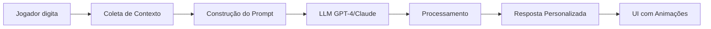
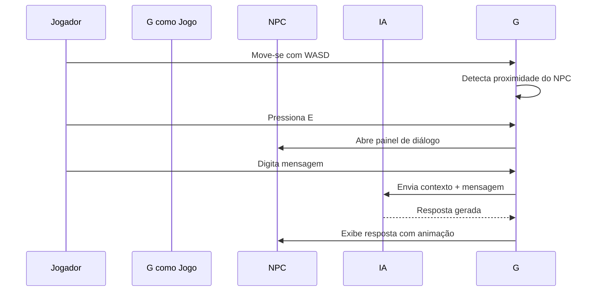

# 🛡️ Pixel Paladins

<div align="center">


**Um RPG impulsionada por Inteligência Artificial**

[](https://www.typescriptlang.org/)
[](https://react.dev/)
[](https://vitejs.dev/)
[](LICENSE)

</div>

---

## 🎮 Sobre o Projeto

**Pixel Paladins** é um **RPG ** que redefine a interação entre jogadores e NPCs (Non-Player Characters). Diferente dos jogos tradicionais onde os NPCs seguem scripts pré-determinados, aqui cada personagem é impulsionado por **Inteligência Artificial avançada**, criando diálogos únicos, dinâmicos e contextualizados a cada interação.

### 🌟 A Revolução dos NPCs com IA

> **Converse como nunca antes** — Cada NPC possui personalidade própria, memória de interações passadas e capacidade de gerar respostas naturais em tempo real. Não há dois diálogos iguais!

**O que torna o Pixel Paladins único:**
- 🧠 **IA Generativa** — NPCs usam modelos de linguagem para criar respostas únicas
- 💾 **Memória Persistente** — NPCs lembram de você e de conversas anteriores
- 🎭 **Personalidades Únicas** — Cada personagem tem sua própria voz e comportamento
- 🌍 **Contexto Rico** — Diálogos consideram hora, localização, relações e histórico

---

## ✨ Recursos Principais

### 🤖 NPCs Impulsionados por IA

| Característica | Descrição |
|----------------|-----------|
| **Personalidades Únicas** | Cada NPC tem um "system prompt" que define quem é, como fala e o que sabe |
| **Diálogos Naturais** | Conversas geradas em tempo real, sem roteiros pré-escritos |
| **Contexto Rico** | NPCs consideram hora do dia, localização, histórico e relações |
| **Memória de Interações** | Lembram de conversas anteriores e evoluem com o tempo |
| **Reações Dinâmicas** | Comportamentos que variam conforme o contexto emocional |

### 🎮 Experiência de Jogo

- **Mundo Pixel Art Imersivo** — Estética retrô com profundidade emocional
- **Exploração Livre** — Navegue por uma vila viva e reativa
- **Interações Significativas** — Cada conversa conta uma história única
- **Interface Intuitiva** — Diálogos elegantes com feedback visual

---

## 📸 Demonstração Visual

### 🏘️ A Vila


*Explorando a vila pixelada — cada canto tem histórias para contar*

### 💬 Sistema de Diálogo


*Conversas em tempo real com NPCs impulsionados por IA*

### 👥 Personagens


*Cada NPC com personalidade, aparência e comportamento próprios*

### 🎯 Gameplay


*Explore, interaja e descubra histórias únicas em cada conversa*

---

## 🎭 Personagens da Vila

| Personagem | Papel | Personalidade |
|------------|-------|---------------|
| **Flora** 🧑 | Mentora | Sábia, calma, usa metáforas sobre natureza |
| **Rex** 🧑‍🔬 | Inventor | Excêntrico, engraçado, sempre com ideias malucas |
| **Luna** 🧙‍♀️ | Mistério | Enigmática, filosófica, ninguém sabe de onde veio |
| **Bento** 👨🍳 | Cozinheiro | Animado, caloroso, adora cozinhar |
| **Aria** 🧑‍🎨 | Artista | Sonhadora, sensível, toca piano |
| **Gael** 🧭 | Explorador | Aventureiro, conta histórias de viagens |

> Cada personagem é definido por um **system prompt** personalizado que guia seu comportamento, tom de voz, conhecimento e reações emocionais.

---

## 🏗️ Arquitetura Técnica

### Como Funciona o Sistema de IA



### Pipeline Completo

1. **📊 Coleta de Contexto**
   - Identidade do NPC (personalidade, conhecimento, histórico)
   - Contexto ambiental (hora, localização, NPCs próximos)
   - Histórico da conversa atual

2. **📝 Construção do Prompt**
   - Template dinâmico com todas as variáveis
   - Instruções de comportamento e tom
   - Restrições de segurança e conteúdo

3. **🧠 Processamento pela IA**
   - Envio para LLM (GPT-4, Claude, ou similar)
   - Análise de emoção e intenção
   - Geração de resposta natural

4. **✨ Exibição na UI**
   - Animações de "pensando"
   - Feedback visual de carregamento
   - Transições suaves

### Stack Tecnológico

| Categoria | Tecnologias |
|-----------|-------------|
| **Frontend** | React, TypeScript, Vite |
| **Estilização** | Tailwind CSS, Framer Motion |
| **Componentes** | shadcn/ui |
| **Roteamento** | React Router v6 |
| **Estado** | TanStack Query |
| **Linting** | ESLint, Prettier |

---

## 🎮 Como Jogar

### Controles

| Tecla | Ação |
|-------|------|
| **W / ↑** | Mover para cima |
| **S / ↓** | Mover para baixo |
| **A / ←** | Mover para esquerda |
| **D / →** | Mover para direita |
| **E** | Interagir com NPC próximo |
| **ENTER** | Enviar mensagem no diálogo |
| **ESC** | Fechar diálogo |

### Gameplay



1. **Explore** a vila movendo-se com **WASD**
2. **Aproxime-se** de um NPC (o nome aparecerá no HUD)
3. **Pressione E** para iniciar uma conversa
4. **Digite** sua mensagem e pressione **ENTER**
5. **Observe** a IA "pensar" (indicador de carregamento)
6. **Leia** a resposta única e contextualizada
7. **Continue** a conversa ou explore outros NPCs

---

## 🚀 Instalação e Execução

### Pré-requisitos

- **Node.js** ≥ 18.x
- **npm** ou **yarn**
- **Git**

### Configuração Rápida

```bash
# 1. Clone o repositório
git clone https://github.com/seu-usuario/pixel-paladins.git
cd pixel-paladins

# 2. Instale as dependências
npm install

# 3. Inicie o servidor de desenvolvimento
npm run dev
```

### Acesse o Projeto

Abra seu navegador em: **`http://localhost:5173`**

---

## 📁 Estrutura do Projeto

```
pixel-paladins/
├── src/
│   ├── components/
│   │   ├── game/              # Lógica principal do jogo
│   │   │   ├── GameWorld.tsx       # Renderização do mundo
│   │   │   ├── GameHUD.tsx         # Interface do usuário
│   │   │   ├── PlayerSprite.tsx    # Personagem do jogador
│   │   │   ├── NPCSprite.tsx       # Renderização de NPCs
│   │   │   ├── PixelCharacter.tsx  # Estilização de personagens
│   │   │   ├── TileRenderer.tsx    # Tiles do mapa
│   │   │   ├── mapData.ts          # Dados do mapa e NPCs
│   │   │   ├── types.ts            # Definições TypeScript
│   │   │   └── useGameLoop.ts      # Game loop principal
│   │   └── ui/                 # Componentes shadcn/ui
│   ├── pages/                  # Páginas da aplicação
│   ├── hooks/                  # Custom React hooks
│   ├── lib/                    # Utilitários e helpers
│   └── App.tsx                 # App principal
├── doc/                        # Documentação detalhada
│   ├── AI_SYSTEM.md           # Sistema de IA
│   ├── PROJECT_DOCUMENTATION.md # Docs completos
│   └── TECHNICAL_ARCHITECTURE.md # Arquitetura técnica
├── public/                     # Assets estáticos
└── test/                       # Testes automatizados
```

---

## 🎨 Screenshots

<div align="center">

| Exploração da Vila | Sistema de Diálogo | Personagens |
|--------------------|--------------------|-------------|
|  |  |  |
| *Navegue livremente pelo mundo* | *Converse com NPCs em tempo real* | *Cada um com personalidade única* |

</div>

---

## 💡 Por Que Este Projeto?

### 🎯 Objetivos de Pesquisa

Este projeto explora as fronteiras entre **Inteligência Artificial** e **Desenvolvimento de Jogos**, com foco em:

1. **🤖 NPCs Conscientes e Interativos**
   - Como criar personagens que realmente "conversam" em vez de apenas seguir scripts
   - Implementação de memória de longo prazo para NPCs
   - Personalização dinâmica baseada no histórico de interações

2. **🏗️ Arquitetura de Software para IA Generativa**
   - Padrões de design para integrar LLMs em aplicações em tempo real
   - Separação de responsabilidades entre UI, lógica de jogo e IA
   - Otimização de latência em chamadas de API

3. **🎭 Experiência do Usuário Imersiva**
   - Interfaces naturais para interação com IA
   - Feedback visual durante processamento
   - Transições suaves entre estados de jogo

4. **⚡ Performance e Escalabilidade**
   - Cache inteligente de respostas contextuais
   - Previsão de ações do jogador para reduzir latência percebida
   - Gerenciamento eficiente de múltiplas instâncias de NPCs

---

## 📚 Documentação Completa

Para uma visão mais detalhada do projeto, consulte nossa documentação:

| Documento | Descrição |
|-----------|-----------|
| **[Documentação do Projeto](./doc/PROJECT_DOCUMENTATION.md)** | Visão geral completa do projeto e objetivos |
| **[Sistema de IA](./doc/AI_SYSTEM.md)** | Detalhes técnicos sobre como os NPCs funcionam |
| **[Arquitetura Técnica](./doc/TECHNICAL_ARCHITECTURE.md)** | Design de sistemas e decisões de arquitetura |

---

## 🤝 Contribuindo

Este projeto é um experimento em desenvolvimento. Contribuições são bem-vindas!

### Como Contribuir

1. Fork o repositório
2. Crie uma branch para sua feature (`git checkout -b feature/AmazingFeature`)
3. Commit suas mudanças (`git commit -m 'Add some AmazingFeature'`)
4. Push para a branch (`git push origin feature/AmazingFeature`)
5. Abra um Pull Request

### Áreas de Interesse

- 🎨 **Melhorias na UI/UX** — Tornar a experiência mais imersiva
- 🤖 **Otimização de IA** — Melhorar performance e qualidade das respostas
- 🎮 **Novos NPCs** — Criar personagens com personalidades únicas
- 📝 **Documentação** — Melhorar e expandir a documentação

---

## 📄 Licença

Este projeto é licenciado sob a Licença MIT — veja o arquivo [LICENSE](LICENSE) para detalhes.

---

## 🙏 Agradecimentos

- **Comunidade shadcn/ui** — Componentes UI incríveis
- **React Team** — Framework que torna tudo possível
- **OpenAI / Anthropic** — Modelos de IA que tornam os NPCs possíveis

---

<div align="center">

**Feito com ❤️ e IA**

[GitHub](https://github.com/seu-usuario/pixel-paladins) • [Documentação](./doc/README.md) • [Issues](https://github.com/seu-usuario/pixel-paladins/issues)

</div>
