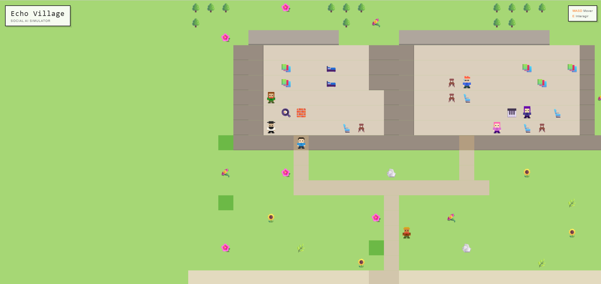
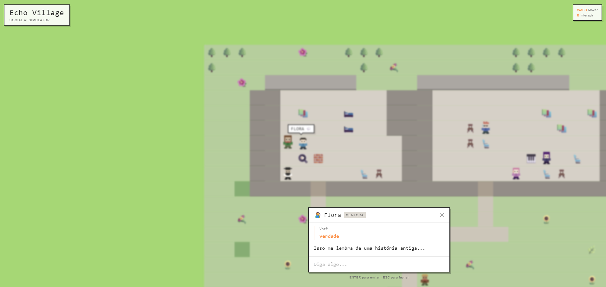

# Pixel Paladins - Resumo Executivo

## 🎮 O que é o Pixel Paladins?

**Pixel Paladins** (também conhecido como **"Echo Village"**) é um simulador social interativo ambientado em um mundo pixel art. É um experimento que combina a nostalgia dos jogos retrô com a tecnologia moderna de Inteligência Artificial.

###  Em poucas palavras

Imagine um jogo onde você pode:
- 🏃‍♂️ Explorar uma vila charmosa em pixel art
- 💬 Conversar com NPCs (personagens) que parecem reais
- 🎭 Cada personagem tem personalidade única, história e comportamento próprio
- 🤖 As conversas são geradas por IA, tornando cada interação única

---

## 🌟 Ideias Principais

### 1. **IA Social em Jogos**
Como criar personagens NPCs que parecem pessoas reais? O Pixel Paladins explora isso usando IA para gerar diálogos naturais e personalizados.

### 2. **Narrativa Emergente**
Em vez de roteiros pré-definidos, as histórias surgem naturalmente das conversas entre jogador e NPCs. Cada jogador terá experiências únicas.

### 3. **Mundo Pixel Art Moderno**
A estética retrô dos jogos clássicos encontra a tecnologia contemporânea. Visual simples, mas com profundidade emocional.

### 4. **Simulação Social**
Cada NPC da vila tem:
- Personalidade própria
- Rotina e comportamento
- Memória das interações
- Relações com outros NPCs

---

## 🏘️ A Vila

A vila do Pixel Paladins é um lugar pequeno, mas cheio de vida:

### Personagens Principais

| Personagem | Papel | Personalidade |
|------------|-------|---------------|
| **Flora** 🧑 | Mentora | Sábia, calma, usa metáforas sobre natureza |
| **Rex** 🧑‍🔬 | Inventor | Excêntrico, engraçado, sempre com ideias malucas |
| **Luna** 🧙‍♀️ | Mistério | Enigmática, filosófica, ninguém sabe de onde veio |
| **Bento** 👨🍳 | Cozinheiro | Animado, caloroso, adora cozinhar |
| **Aria** 🧑‍🎨 | Artista | Sonhadora, sensível, toca piano |
| **Gael** 🧭 | Explorador | Aventureiro, conta histórias de viagens |

Cada personagem:
- Tem uma **personalidade única** definida por um "system prompt"
- Fala de maneira característica (rápido, devagar, poético, etc.)
- Reage ao contexto (hora do dia, localização, quem está por perto)
- Lembra das conversas anteriores

---

## � Capturas de Tela

### Jogo em Ação



*Explorando a vila e interagindo com NPCs*



*Sistema de diálogo com NPCs*

---

## �🛠️ Como Funciona Tecnicamente

### Arquitetura Atual (Fase de Desenvolvimento)

```
Jogador → Digita mensagem → Sistema Simulado → Resposta pré-definida
```

**Status:** O sistema atual usa respostas simuladas para desenvolvimento.

### Arquitetura Futura (IA Real)

```
Jogador → Digita mensagem → Construtor de Contexto → LLM (GPT-4, Claude, etc.) → Resposta Personalizada → UI
```

**Pipeline completo:**
1. **Coleta de contexto**: Quem é o NPC? Onde estamos? Que hora é?
2. **Construção do prompt**: Monta uma mensagem rica com todas as informações
3. **Chamada à IA**: Envia para um modelo de linguagem (GPT-4, Claude, etc.)
4. **Processamento**: Analisa emoção, ação, segurança
5. **Exibição**: Mostra a resposta na UI com animações

### Tecnologias Usadas

| Categoria | Tecnologia |
|-----------|------------|
| **Frontend** | React, TypeScript |
| **Build Tool** | Vite |
| **Estilização** | Tailwind CSS |
| **Componentes** | shadcn/ui |
| **Animações** | Framer Motion |
| **Roteamento** | React Router |
| **Estado** | TanStack Query |

---

## 🎮 Como Jogar

### Controles

| Tecla | Ação |
|-------|------|
| **W / ↑** | Mover para cima |
| **S / ↓** | Mover para baixo |
| **A / ←** | Mover para esquerda |
| **D / →** | Mover para direita |
| **E** | Interagir com NPC próximo |
| **ENTER** | Enviar mensagem |
| **ESC** | Fechar diálogo |

### Gameplay

1. **Explore** a vila movendo-se com WASD
2. **Aproxime-se** de um NPC (você verá o nome aparecer)
3. **Pressione E** para iniciar uma conversa
4. **Digite** sua mensagem e pressione ENTER
5. **Aguarde** a resposta do NPC (indicador de "pensando")
6. **Continue** a conversa ou feche o diálogo

---

## 💡 Por que este projeto?

### Objetivos de Aprendizado

1. **Integração de IA em Jogos**: Como usar LLMs para criar NPCs mais realistas
2. **Arquitetura de Software**: Padrões de design para aplicações complexas
3. **Experiência do Usuário**: Criar interfaces naturais para interação com IA
4. **Performance**: Balancear qualidade da IA com tempo de resposta

### Desafios Técnicos

- ⚡ **Latência**: Respostas de IA podem ser lentas
- 🧠 **Contexto**: Manter consistência em conversas longas
- 🎭 **Personalidade**: Garantir que cada NPC mantenha sua personalidade
- 🔒 **Segurança**: Filtrar conteúdo inadequado
- 💾 **Memória**: Lembrar de interações passadas

---

## 📊 Estado do Projeto

### ✅ Concluído

- [x] Estrutura do projeto
- [x] Sistema de movimento do jogador
- [x] Sistema de colisão (tiles e NPCs)
- [x] Renderização de mapa em pixel art
- [x] Sistema de diálogos
- [x] 6 NPCs com personalidades únicas
- [x] Animações suaves (camera, NPCs, diálogos)
- [x] Simulação de IA (respostas pré-definidas)
- [x] Documentação completa

### 🚧 Em Desenvolvimento

- [ ] Integração com API de IA real (GPT-4, Claude, etc.)
- [ ] Sistema de memória persistente
- [ ] Sistema de reputação com NPCs
- [ ] Mais NPCs e áreas
- [ ] Missões e quests

### 🎯 Futuro

- [ ] Multiplayer cooperativo
- [ ] Sistema de inventário
- [ ] Eventos dinâmicos na vila
- [ ] Ciclo dia/noite
- [ ] Weather system
- [ ] PWA (Progressive Web App)

---

## 📁 Estrutura de Documentação

Este projeto possui 3 documentos principais:

### 1. **PROJECT_DOCUMENTATION.md** 📖
Documentação geral do projeto:
- Visão geral e conceitos
- Tecnologias utilizadas
- Mecânicas do jogo
- Lista completa de NPCs
- Como rodar o projeto

### 2. **TECHNICAL_ARCHITECTURE.md** 🏗️
Documentação técnica detalhada:
- Arquitetura do sistema
- Padrões de código
- Implementação do game loop
- Sistema de mapa
- Componentes React
- Otimizações e performance

### 3. **AI_SYSTEM.md** 🤖
Documentação do sistema de IA:
- Filosofia de design dos NPCs
- System prompts e personalidades
- Pipeline de processamento de IA
- Sistema de contexto
- Memória e persistência
- Segurança e filtragem

---

## 🚀 Como Rodar o Projeto

### Pré-requisitos

- Node.js (versão 18 ou superior)
- npm ou yarn

### Instalação

```bash
# 1. Clone o repositório
git clone <repository-url>
cd pixel-paladins

# 2. Instale as dependências
npm install

# 3. Inicie o servidor de desenvolvimento
npm run dev
```

### Acesse

Abra seu navegador em `http://localhost:3000`

---

## 🎨 Screenshots

O projeto apresenta:
- **Visual pixel art** com estética retrô
- **Interface limpa** e intuitiva
- **Animações suaves** (camera, NPCs, diálogos)
- **HUD minimalista** mostrando controles
- **Painel de diálogo** fixo na parte inferior

---

## 🤝 Contribuindo

Este é um projeto educacional/experimental. Para contribuir:

1. Fork o repositório
2. Crie uma branch para sua feature
3. Faça suas mudanças
4. Abra um Pull Request

---

## 📝 Licença

Projeto educacional para exploração de IA em jogos.

---

## 🎯 Próximos Passos

### Curto Prazo (1-2 meses)
- [ ] Integrar IA real (OpenAI GPT-4 ou Claude)
- [ ] Implementar sistema de memória
- [ ] Adicionar mais NPCs
- [ ] Melhorar performance

### Médio Prazo (3-6 meses)
- [ ] Sistema de reputação
- [ ] Missões e quests
- [ ] Inventário e itens
- [ ] Mais áreas para explorar

### Longo Prazo (6+ meses)
- [ ] Multiplayer
- [ ] Eventos sociais
- [ ] Economia entre jogadores
- [ ] Editor de mapas

---

## 💬 Contato

Para dúvidas, sugestões ou colaboração, abra uma issue no repositório.

---

**Pixel Paladins** - Onde a tecnologia encontra a magia dos jogos pixel art! 🎮✨

*Um experimento sobre como a IA pode transformar experiências interativas.*
